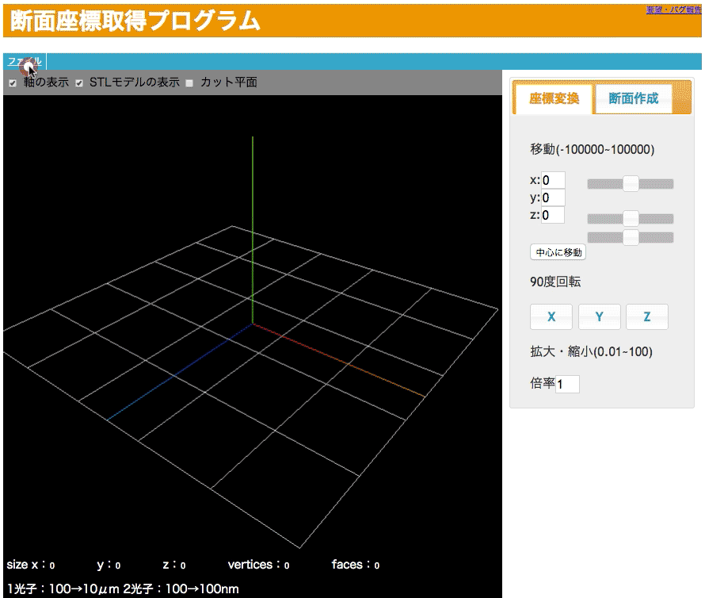

# STLSlicer

STLSlicer is STL Viewer and compute a cross section of the STL.
It is available to export csv or hpgl file format from the cross section.

===
##Usage

###1. Open index.html

###2. Open a STL file which would like to compute cross section

###3. Adjust the position and direction of the model

###4. Set cutting layer pitch and start to compute the cross section
###5. Save cross section as .csv or .hpgl

##Licence and Author
MIT@[wakusei-meron-](http:github.com/wakusei-meron-) 
